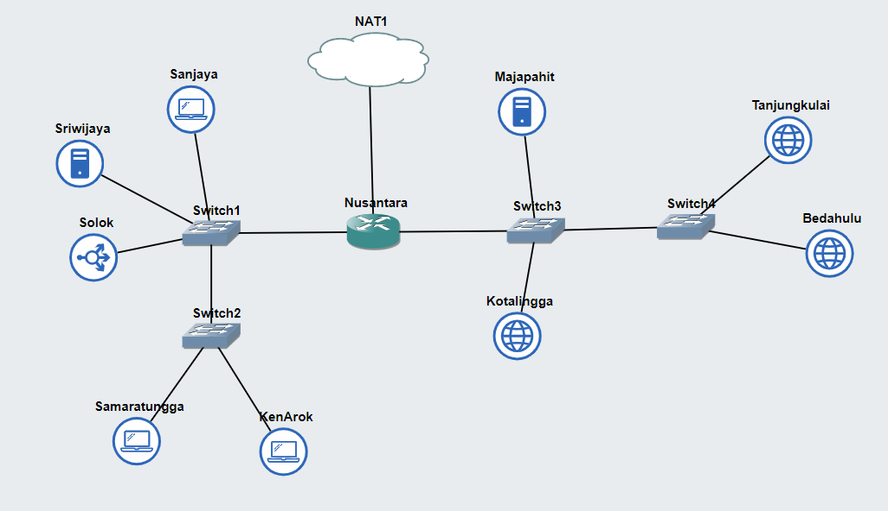

# Jarkom-Modul-2-IT29-2024

### Anggota Kelompok
| Nama | NRP |
|---------|---------|
| Harwinda | 5027221079   |
| Muhammad Syahmi Ash Shidqi | 5027211085   |

#Laporan Resmi

### Topologi


### Prefix
| IT29 | 10.78 |

### Config
#### Nusantara
```
 auto eth0
iface eth0 inet dhcp

auto eth1
iface eth1 inet static
	address 10.78.1.1
	netmask 255.255.255.0

auto eth2
iface eth2 inet static
	address 10.78.2.1
	netmask 255.255.255.0
```

#### Sanjaya
```
auto eth0
iface eth0 inet static
	address 10.78.1.2
	netmask 255.255.255.0
	gateway 10.78.1.1
```

#### Sriwijaya
```
auto eth0
iface eth0 inet static
	address 10.78.1.3
	netmask 255.255.255.0
	gateway 10.78.1.1
```

#### Solok
```
auto eth0
iface eth0 inet static
	address 10.78.1.4
	netmask 255.255.255.0
	gateway 10.78.1.1
```

#### Samaratungga
```
auto eth0
iface eth0 inet static
	address 10.78.1.5
	netmask 255.255.255.0
	gateway 10.78.1.1
```
#### Ruins 
```
auto eth0
iface eth0 inet static
	address 10.72.2.2
	netmask 255.255.255.0
	gateway 10.72.2.1
```

#### KenArok
```
auto eth0
iface eth0 inet static
	address 10.78.1.6
	netmask 255.255.255.0
	gateway 10.78.1.1
```

#### Majapahit
```
auto eth0
iface eth0 inet static
	address 10.78.2.2
	netmask 255.255.255.0
	gateway 10.78.2.1
```

#### Kotalingga
```
auto eth0
iface eth0 inet static
	address 10.78.2.3
	netmask 255.255.255.0
	gateway 10.78.2.1
```

#### Bedahulu
```
auto eth0
iface eth0 inet static
	address 10.78.2.4
	netmask 255.255.255.0
	gateway 10.78.2.1
```

#### Tanjungkulai
```
auto eth0
iface eth0 inet static
	address 10.78.2.5
	netmask 255.255.255.0
	gateway 10.78.2.1
```


### Inisiasi .bashrc 

#### Nusantara
```
iptables -t nat -A POSTROUTING -o eth0 -j MASQUERADE -s 192.173.0.0/16
echo 'nameserver 192.168.122.1' > /etc/resolv.conf
```
#### Sriwijaya & Majapahit
```
echo 'nameserver 192.168.122.1' > /etc/resolv.conf
apt-get update
apt-get install bind9 -y      
```
#### KenArok, Sanjaya & Samaratungga
```
echo -e '
nameserver 10.78.1.3 
nameserver 10.78.2.2 
nameserver 192.168.122.1
' > /etc/resolv.conf
```
